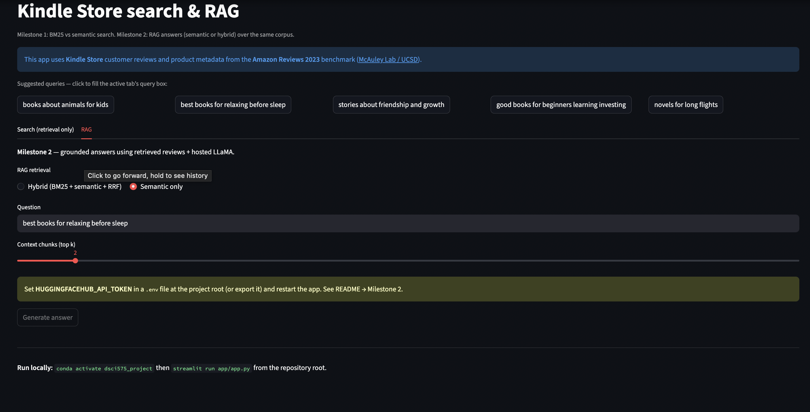
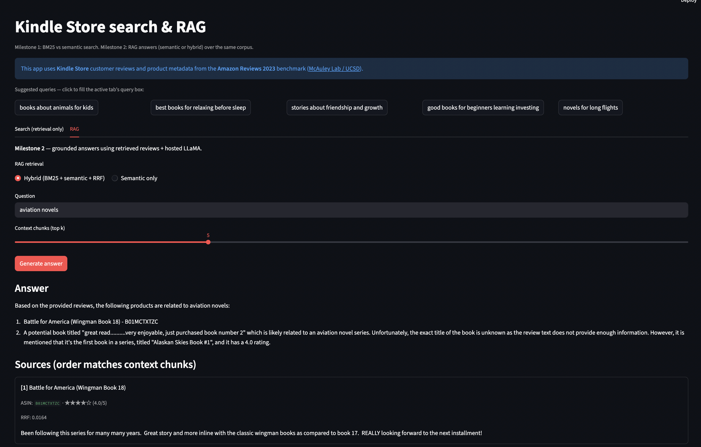
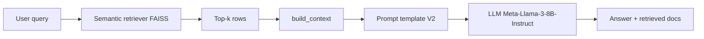
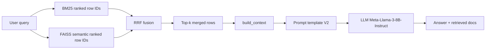

# DSCI_575_project_artazyan_eduard08

## Project Overview

This project builds a search and **RAG** system over Amazon Kindle Store reviews and metadata:

- **Milestone 1:** BM25 (sparse) vs semantic search (dense embeddings + FAISS), compared in the notebook and the **Search** tab of the app.
- **Milestone 2:** **Semantic RAG** and **hybrid RAG** (`src/hybrid.py`: BM25 + semantic fused with RRF), both using the same context builder, prompts, and hosted **Meta-Llama-3-8B-Instruct** (`src/rag_pipeline.py`, **RAG** tab in the app, `notebooks/milestone2_rag.ipynb`).

Qualitative write-up for Milestone 2 (prompts, hybrid design, manual eval) is in `results/milestone2_discussion.md`.

---

## Environment setup

From the project root:

```bash
conda env create -f environment.yml
conda activate dsci575_project
```

Run notebooks:

```bash
jupyter lab
```

Run the app:

```bash
streamlit run app/app.py
```

## Milestone 2: Hugging Face token setup

This project requires a Hugging Face token for hosted LLM inference.

Create a token:

1. Go to https://huggingface.co/settings/tokens
2. Sign in
3. Click **New token**
4. Give it a name (for example: `dsci575-rag`)
5. Choose scope: **Read** (usually enough for inference endpoints)
6. Create and copy the token (it starts with `hf_...`)

Add token to `.env` at the project root:

```env
HUGGINGFACEHUB_API_TOKEN=hf_your_token_here
```

Or export it in your terminal:

```bash
export HUGGINGFACEHUB_API_TOKEN=hf_your_token_here
```

---

## How to Run

1. Launch Jupyter Lab:
```bash
jupyter lab
```

2. Open and run:
```bash
notebooks/milestone1_exploration.ipynb
```

3. Milestone 2 RAG / hybrid exploration:
```bash
notebooks/milestone2_rag.ipynb
```

---

## Streamlit App (Query Dashboard)

Two tabs:

- **Search** — BM25 vs semantic retrieval (Milestone 1), results table only.  
- **RAG** — semantic or hybrid retrieval + LLM answer, numbered sources, and raw context in an expander. Requires **`HUGGINGFACEHUB_API_TOKEN`** (see Milestone 2 env setup above).

### Prerequisites (in data/processed/)

- merged.parquet  
- bm25.pkl  
- semantic_faiss.index  
- semantic_meta.json  

### Run the app

```bash
conda activate dsci575_project
streamlit run app/app.py
```

Then open:
http://localhost:8501

### Screenshots

**BM25 retrieval**


**Semantic retrieval**


**Milestone 2: RAG Improvements and Implementation**

The RAG tab showcases the enhanced retrieval-augmented generation pipeline, which combines semantic or hybrid retrieval with LLM-powered answers. Numbered sources and the raw context are provided to ensure transparency and traceability.

**Hybrid (BM25 + Semantic + RRF) Retrieval + LLM**



**Semantic-Only RAG Retrieval + LLM**


---

## Workflow

1. Convert raw data to parquet using DuckDB  
2. Merge review and metadata datasets  
3. Construct document field (title + description + reviews)  
4. Tokenize text using src/utils.py  
5. Build BM25 index  
6. Build semantic search index using embeddings + FAISS  

---

## RAG pipeline workflow

Code lives in `src/rag_pipeline.py`:

- **`semantic_rag_pipeline`** — FAISS semantic retrieval only, then shared **context → prompt (V2) → LLM**.
- **`hybrid_rag_pipeline`** — **`hybrid_retriever`** in `src/hybrid.py` (BM25 + FAISS rankings fused with **RRF**), then the **same** context → prompt → LLM path.

Both pipelines use `build_context` / `build_prompt` and the hosted **Meta-Llama-3-8B-Instruct** endpoint.

### Semantic RAG (Step 2)



### Hybrid RAG (Step 3–3.4)



---

## Results

### Milestone 1: Retrieval Evaluation
Results and analysis comparing BM25 and semantic search can be found in:

results/milestone1_discussion.md

### Milestone 2: RAG evaluation
Qualitative evaluation covers **semantic-only** and **hybrid** RAG (prompt variants V1–V3, top‑k notes, five manual queries, limitations, improvements):

results/milestone2_discussion.md