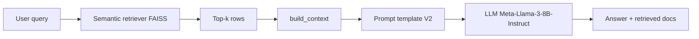
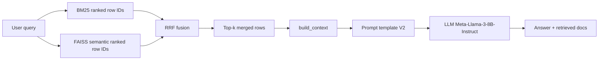

# DSCI_575_project_artazyan_eduard08

## Project Overview

This project builds a search and **RAG** system over Amazon Kindle Store reviews and metadata:

- **Milestone 1:** BM25 (sparse) vs semantic search (dense embeddings + FAISS), compared in the notebook and the **Search** tab of the app.
- **Milestone 2:** **Semantic RAG** and **hybrid RAG** (`src/hybrid.py`: BM25 + semantic fused with RRF), both using the same context builder, prompts, and hosted **Meta-Llama-3-8B-Instruct** (`src/rag_pipeline.py`, **RAG** tab in the app, `notebooks/milestone2_rag.ipynb`).
- **Milestone 3 (final):** **Side-by-side LLM comparison** (Meta-Llama-3-8B-Instruct vs Qwen3-8B) on the same RAG context, **final model selection** (Llama), and a **publicly deployed** Streamlit dashboard (see [New features](#new-features-milestone-3--final) below). Qualitative write-ups: `results/milestone2_discussion.md` (Milestone 2 RAG), `results/final_discussion.md` (final milestone).

---

## New features (Milestone 3 & final)

| Feature | What it is | Where to find it |
|--------|------------|------------------|
| **LLM comparison** | Two 8B-class models (Llama 3 and Qwen3) evaluated with **identical** retrieval, context, and prompt over **5 queries** | `notebooks/final_llm_experiment.ipynb`, discussion in this README under [Milestone 3: LLM comparison](#milestone-3-llm-comparison-and-final-model) |
| **Final model** | **Meta-Llama-3-8B-Instruct** chosen for better grounding, brevity, and instruction-following | Used in `src/rag_pipeline.py` and the app’s RAG tab |
| **Deployed app** | Full query dashboard (Search + RAG) without a local install | [kindle-review-rag-engine.streamlit.app](https://kindle-review-rag-engine.streamlit.app/) |
| **Final discussion** | Dataset scaling, LLM experiment, additional feature, documentation/code quality, **cloud deployment plan** | `results/final_discussion.md` |

---

## Setup instructions

Follow these steps **in order** from the project root.

### 0. Clone the repository and enter the project directory

```bash
git clone https://github.com/<YOUR_USERNAME>/DSCI_575_project_artazyan_eduard08.git
cd DSCI_575_project_artazyan_eduard08
```

Use your fork or course group URL in place of `<YOUR_USERNAME>` if different.

### 1. Python environment (Conda)

```bash
conda env create -f environment.yml
conda activate dsci575_project
```

This installs Python 3.11, JupyterLab, and pip dependencies (FAISS, Streamlit, LangChain, sentence-transformers, etc.).

### 2. Hugging Face token (required for RAG and LLM experiments)

The hosted LLM uses **Hugging Face Inference**; the token must be available as **`HUGGINGFACEHUB_API_TOKEN`**.

1. Create a token: [huggingface.co/settings/tokens](https://huggingface.co/settings/tokens) → **New token** → scope **Read** is usually enough.
2. At the project root, create a `.env` file (do not commit it):

   ```env
   HUGGINGFACEHUB_API_TOKEN=hf_your_token_here
   ```

   Or in the shell: `export HUGGINGFACEHUB_API_TOKEN=hf_your_token_here`

`python-dotenv` loads `.env` when you run the Streamlit app and many notebooks.

### Data description and fields used

**Source:** [Amazon Reviews 2023](https://mcauleylab.ucsd.edu/public_datasets/data/amazon_2023/) (McAuley Lab, UCSD). This project uses the **Kindle Store** category: review and product **metadata** JSONL is downloaded (see `notebooks/milestone1_exploration.ipynb`), written to Parquet under `data/raw/`, then **inner-joined** on `parent_asin` so every row has both a review and product metadata.

**`data/processed/merged.parquet`** (one row per review, joined to its product) includes:

| Column | Role |
|--------|------|
| `parent_asin` | Product identifier (join key, also used in RAG citations) |
| `rating` | Star rating for this review |
| `review_title`, `review_text` | Review headline and body |
| `verified_purchase` | Whether the review is from a verified purchase |
| `product_title` | Product name from metadata |
| `average_rating`, `main_category` | Aggregated product stats / category from metadata |
| `description`, `features` | Product copy and bullet features (when present) |

Downstream, a single searchable **`document`** string is built per row (product fields + review text) for **BM25** tokenization and **semantic** embeddings; indices (`bm25.pkl`, `semantic_faiss.index`) align **row index** with `merged.parquet`.

### 3. Processed data and indices (required to run the app and most notebooks)

The app and retrieval code expect these files under **`data/processed/`**:

- `merged.parquet`
- `bm25.pkl`
- `semantic_faiss.index`
- `semantic_meta.json`

If you are starting from the **raw** Amazon review/metadata inputs, run the project **workflow** in order (DuckDB → merge → feature construction → tokenization → BM25 + FAISS builds), as sketched in [Workflow](#workflow) and the Milestone 1–2 notebooks, until these artifacts exist. If a teammate or release bundle already provides a populated `data/processed/`, place those files in that directory.

### 4. Run Jupyter or Streamlit (see [Usage examples](#usage-examples))

---

## Usage examples

### Notebooks (exploration and experiments)

1. Start Jupyter from the project root:

   ```bash
   conda activate dsci575_project
   jupyter lab
   ```

2. In the Jupyter UI, open and run (top to bottom inside each notebook as needed):
   - **`notebooks/milestone1_exploration.ipynb`** — EDA, index builds, and a **side-by-side BM25 vs semantic** table for every evaluation query (run cells in order through `semantic_outputs`; paraphrase pair *book to relax before bed* / *best books for relaxing before sleep* illustrates lexical vs meaning).
   - **`notebooks/milestone2_rag.ipynb`** — Semantic and hybrid RAG, prompts, manual evaluation.
   - **`notebooks/final_llm_experiment.ipynb`** — Milestone 3 LLM comparison (Llama vs Qwen) on the same RAG context.

### Streamlit app (local)

```bash
conda activate dsci575_project
streamlit run app/app.py
```

Then open **<http://localhost:8501>** in a browser.

**Example — Search tab:** enter a product-related question, choose **BM25** or **Semantic**, and inspect the results table.  
**Example — RAG tab:** choose **Semantic** or **Hybrid** retrieval, enter a question (e.g. about battery, screen, or a specific **ASIN** if your data includes it), and read the model answer, **numbered sources**, and **raw context** in the expander.

### Streamlit app (deployed, no local data needed on your machine for the host)

The same dashboard is hosted at: **[https://kindle-review-rag-engine.streamlit.app/](https://kindle-review-rag-engine.streamlit.app/)** (the app host must have the processed data and token configured; use local run for full control).

---

## Streamlit App (Query Dashboard) — details

**Additional feature — deployed app:** the full query dashboard is hosted at [https://kindle-review-rag-engine.streamlit.app/](https://kindle-review-rag-engine.streamlit.app/).

**Tabs:**

- **Search** — BM25 vs semantic retrieval (Milestone 1), results table only.  
- **RAG** — semantic or hybrid retrieval + LLM answer, numbered sources, and raw context in an expander. Requires **`HUGGINGFACEHUB_API_TOKEN`** (see [Setup](#2-hugging-face-token-required-for-rag-and-llm-experiments)).

**Prerequisites (in `data/processed/`):** `merged.parquet`, `bm25.pkl`, `semantic_faiss.index`, `semantic_meta.json`.

**Run locally** (see [Usage examples](#streamlit-app-local)):

```bash
conda activate dsci575_project
streamlit run app/app.py
```

Then open: http://localhost:8501

### Screenshots

**BM25 retrieval**


**Semantic retrieval**


**Milestone 2: RAG Improvements and Implementation**

The RAG tab showcases the enhanced retrieval-augmented generation pipeline, which combines semantic or hybrid retrieval with LLM-powered answers. Numbered sources and the raw context are provided to ensure transparency and traceability.

**Hybrid (BM25 + Semantic + RRF) Retrieval + LLM**


**Semantic-Only RAG Retrieval + LLM**


---

## Workflow

1. Convert raw data to parquet using DuckDB  
2. Merge review and metadata datasets  
3. Construct document field (title + description + reviews)  
4. Tokenize text using `src/utils.py`  
5. Build BM25 index  
6. Build semantic search index using embeddings + FAISS  

---

## RAG pipeline workflow

Code lives in `src/rag_pipeline.py`:

- **`semantic_rag_pipeline`** — FAISS semantic retrieval only, then shared **context → prompt (V2) → LLM**.
- **`hybrid_rag_pipeline`** — **`hybrid_retriever`** in `src/hybrid.py` (BM25 + FAISS rankings fused with **RRF**), then the **same** context → prompt → LLM path.

Both pipelines use `build_context` / `build_prompt` and the hosted **Meta-Llama-3-8B-Instruct** endpoint.

### Semantic RAG (Step 2)



### Hybrid RAG (Step 3–3.4)



---

## Results

### Milestone 1: Retrieval Evaluation
Results and analysis comparing BM25 and semantic search can be found in:

`results/milestone1_discussion.md`

### Milestone 2: RAG evaluation
Qualitative evaluation covers **semantic-only** and **hybrid** RAG (prompt variants V1–V3, top‑k notes, five manual queries, limitations, improvements):

`results/milestone2_discussion.md`

---

## Milestone 3: LLM comparison and final model

We evaluated two LLMs within the same RAG pipeline:

- **Meta-Llama-3-8B-Instruct**
- **Qwen3-8B**

Both models were tested using the same retrieved context and prompt across 5 queries.

### Key Findings

- **Llama** produced more concise, coherent, and instruction-aligned responses; it consistently used only the provided context and clearly handled cases with insufficient information.
- **Qwen** generated more verbose outputs and often included intermediate reasoning (e.g. Qwen3 *redacted-thinking* / internal trace tokens), which led to less direct and sometimes less relevant answers.

### Final Model Choice

Based on these results, we selected **Meta-Llama-3-8B-Instruct** as the final model due to its better grounding, consistency, and adherence to instructions.
