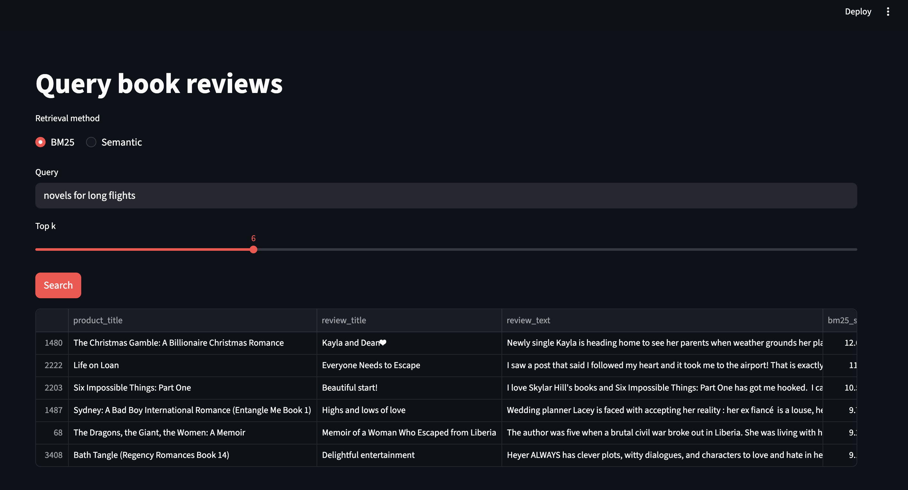
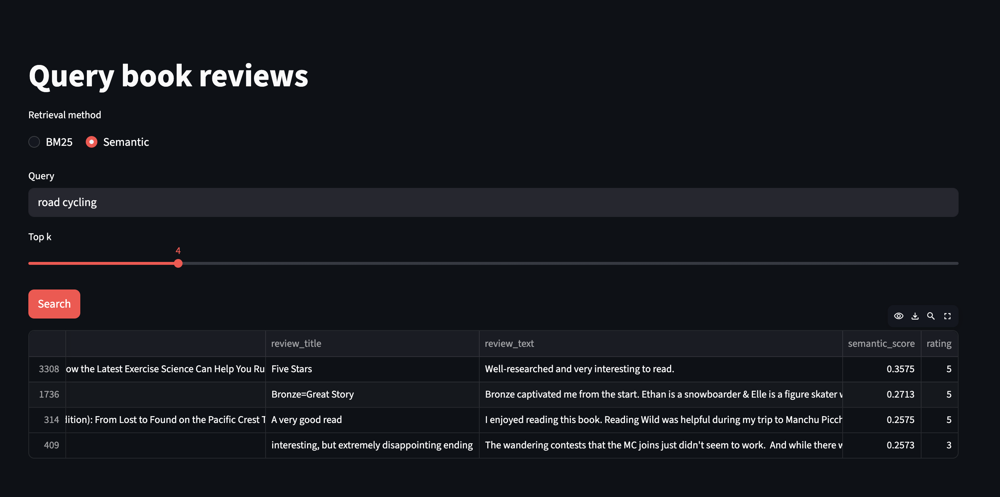

# DSCI_575_project_artazyan_eduard08

## Project Overview

This project builds a search system over Amazon Kindle Store data using two approaches:

- BM25 (keyword-based retrieval)
- Semantic search (dense embeddings + FAISS)

The goal is to compare both methods in terms of relevance and performance across different query types.

---

## Milestone 1: Environment

From the repo root:

```bash
conda env create -f environment.yml
conda activate dsci575_project
jupyter lab
```

## Milestone 2: Rag Environment Setup

This project requires a Hugging Face API token.

You can set it in a `.env` file at the root of the project:

HUGGINGFACEHUB_API_TOKEN=your_token_here

Alternatively, you can export it directly in your terminal:

export HUGGINGFACEHUB_API_TOKEN=your_token_here

You can generate a token at:
https://huggingface.co/settings/tokens

---

## How to Run

1. Launch Jupyter Lab:
```bash
jupyter lab
```

2. Open and run:
```bash
notebooks/milestone1_exploration.ipynb
```

---

## Streamlit App (Query Dashboard)

Two tabs:

- **Search** — BM25 vs semantic retrieval (Milestone 1), results table only.  
- **RAG** — semantic or hybrid retrieval + LLM answer, numbered sources, and raw context in an expander. Requires **`HUGGINGFACEHUB_API_TOKEN`** (see Milestone 2 env setup above).

### Prerequisites (in data/processed/)

- merged.parquet  
- bm25.pkl  
- semantic_faiss.index  
- semantic_meta.json  

### Run the app

```bash
conda activate dsci575_project
streamlit run app/app.py
```

Then open:
http://localhost:8501

### Screenshots

**BM25 retrieval**



**Semantic retrieval**




---

## Workflow

1. Convert raw data to parquet using DuckDB  
2. Merge review and metadata datasets  
3. Construct document field (title + description + reviews)  
4. Tokenize text using src/utils.py  
5. Build BM25 index  
6. Build semantic search index using embeddings + FAISS  

---

## RAG pipeline workflow

Code lives in `src/rag_pipeline.py`:

- **`semantic_rag_pipeline`** — FAISS semantic retrieval, then shared context → prompt → LLM.
- **`hybrid_rag_pipeline`** — `hybrid_retriever` in `src/hybrid.py` (BM25 + semantic + RRF), then the **same** context → prompt → LLM path as semantic RAG.

Given a query, retrieval returns top‑k rows; those rows are formatted with `build_context`, wrapped with `build_prompt`, and sent to the hosted LLaMA model.

<!--
RAG Pipeline Workflow Diagram:

User Query 
   ↓
Semantic Retriever (FAISS)
   ↓
Top-K Relevant Documents
   ↓
Build Context
   ↓
Prompt Template (V2)
   ↓
LLM (Meta LLaMA)
   ↓
Final Answer + Sources
-->

User Query → Semantic Retriever (FAISS) → Top-K Relevant Documents → Build Context → Prompt Template (V2) → LLM (Meta LLaMA) → Final Answer + Sources

---

## Results

### Milestone 1: Retrieval Evaluation
Results and analysis comparing BM25 and semantic search can be found in:

results/milestone1_discussion.md

### Milestone 2: RAG Evaluation
Results and qualitative evaluation of the RAG and hybrid RAG systems can be found in:

results/milestone2_discussion.md